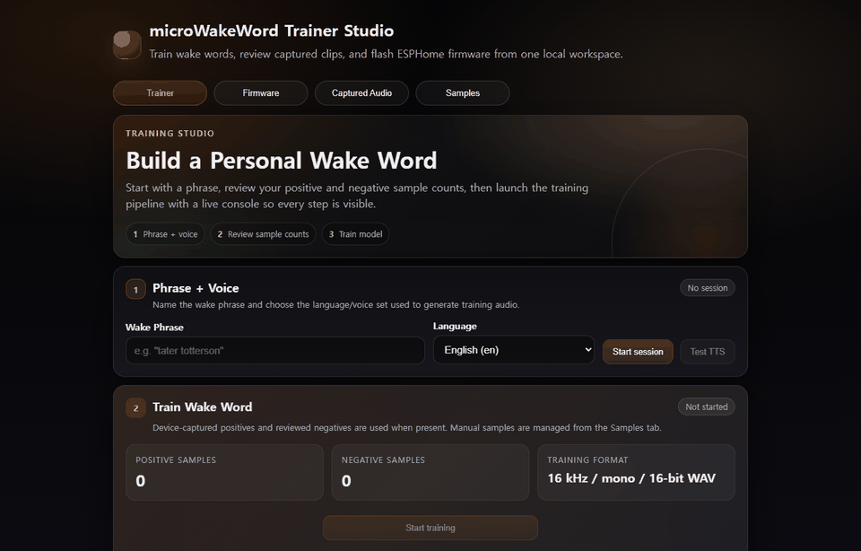

# micro-wake-word-gpu-starter

한국어 | [English](README.en.md)

NVIDIA GPU로 ESPHome용 커스텀 micro wake word 모델을 학습하고 패키징하는 스타터 킷입니다.



위 GIF는 `http://localhost:8789`에서 실행 중인 트레이너 UI를 실제로 캡처한 화면입니다. 일반 동영상 파일로 보고 싶다면 GitHub 파일 뷰 대신 [raw MP4 녹화본](https://raw.githubusercontent.com/seukseok/micro-wake-word-gpu-starter/main/docs/assets/trainer-ui-demo.mp4)을 열면 됩니다.

이 프로젝트는 Home Assistant와 ESPHome 사용자들이 로컬 웨이크 워드 모델을 더 쉽게 만들 수 있도록 돕습니다. Windows/WSL2 친화적인 Docker Compose 구성, 데이터셋 점검, manifest 검증, ESPHome 설정 출력, 실제 UI/영상 데모까지 묶어서 upstream microWakeWord 학습 스택을 바로 써볼 수 있게 만드는 것이 목표입니다.

> 하드웨어 참고: ESP32-S3 보드가 없어도 데이터 준비, GPU 학습, manifest 검증, ESPHome 설정 생성은 할 수 있습니다. 다만 다른 사람에게 모델을 배포하려면 실제 기기에서 false positive 튜닝과 누락 테스트를 반드시 거쳐야 합니다.

## 이 프로그램은 무엇인가요?

ESPHome micro wake word 모델을 NVIDIA GPU로 학습하기 위한 스타터 킷입니다. 새로운 모델 아키텍처를 만든 것도 아니고, upstream 트레이너를 대체하는 것도 아닙니다. 이 저장소의 가치는 트레이너 주변의 귀찮은 연결 작업을 정리하는 데 있습니다. 재현 가능한 Docker 실행, GPU 점검, 데이터셋 메모, smoke-training 스크립트, manifest 검증, ESPHome export, 그리고 clone하기 전에 결과를 확인할 수 있는 실제 UI/영상 데모를 제공합니다.

제품 수준으로 발전시키기 위한 로드맵과 공개 모델 릴리스 기준은 [docs/product-roadmap.md](docs/product-roadmap.md)에 정리되어 있습니다.

## 왜 만들었나요?

이미 좋은 구성 요소들은 존재합니다.

- [OHF-Voice/micro-wake-word](https://github.com/OHF-Voice/micro-wake-word): TensorFlow Lite Micro 웨이크 워드 모델 학습
- [esphome/micro-wake-word-models](https://github.com/esphome/micro-wake-word-models): 바로 쓸 수 있는 모델 manifest 제공
- [TaterTotterson/microWakeWord-Trainer-Nvidia-Docker](https://github.com/TaterTotterson/microWakeWord-Trainer-Nvidia-Docker): CUDA Docker 앱으로 학습 환경 래핑

이 저장소는 그 사이에 비어 있던 스타터 킷 레이어에 집중합니다. 예측 가능한 폴더 구조, GPU 실행 명령, 데이터셋 검증, manifest 점검, 복사해서 쓸 수 있는 ESPHome 출력까지 한 흐름으로 제공합니다.

## 빠른 시작

필요한 것:

- Windows 11 또는 Linux
- 최신 드라이버가 설치된 NVIDIA GPU
- Docker Desktop + WSL2 integration, 또는 Linux Docker Engine
- 선택 사항: 호스트에서 GPU 상태를 확인할 수 있는 `nvidia-smi`

트레이너 UI 실행:

```bash
docker compose up
```

브라우저에서 열기:

```text
http://localhost:8789
```

트레이너는 생성 샘플, 다운로드한 데이터셋, 학습된 모델 파일을 아래 폴더에 저장합니다.

```text
workspace/
```

기대하는 최종 산출물:

```text
workspace/trained_wake_words/<wake_word>.tflite
workspace/trained_wake_words/<wake_word>.json
```

학습된 모델 manifest 검증:

```bash
python scripts/validate_manifest.py workspace/trained_wake_words/hey_komi.json
```

ESPHome snippet 생성:

```bash
python scripts/export_esphome.py workspace/trained_wake_words/hey_komi.json
```

학습 전에 로컬 WAV 샘플 점검:

```bash
python scripts/prepare_dataset.py data/positive data/negative --manifest data/dataset_manifest.json
```

Windows/PowerShell에서 전체 로컬 smoke test 실행:

```powershell
.\scripts\smoke_test.ps1
```

`/data/.venv`가 준비된 뒤 트레이너 GPU 스택 확인:

```powershell
.\scripts\check_trainer_gpu.ps1
```

트레이너 데이터셋을 준비한 뒤 작은 end-to-end 학습 smoke test 실행:

```powershell
.\scripts\train_smoke.ps1 -WakeWord "hey komi" -WakeWordTitle "Hey Komi" -Samples 50 -BatchSize 10 -TrainingSteps 20
```

## 테스트한 하드웨어

이 저장소는 Windows 11 + Docker Desktop 환경의 NVIDIA GeForce RTX 5070 Ti에서 smoke test를 마쳤습니다.

확인한 항목:

- `nvidia/cuda:12.4.1-base-ubuntu22.04` 이미지에서 Docker GPU passthrough 동작
- `docker compose up -d`로 트레이너 컨테이너 시작
- `http://localhost:8789`에서 트레이너 UI가 `HTTP 200` 반환
- 트레이너 내부 Torch가 `cuda_available: true` 보고
- 최초 의존성 설치 이후 warm restart가 5.3초 안에 `HTTP 200` 도달
- helper script가 venv NVIDIA library path를 설정했을 때 TensorFlow 학습이 `/physical_device:GPU:0` 인식

실제 명령 출력은 [examples/rtx-5070-ti-smoke-test.md](examples/rtx-5070-ti-smoke-test.md)에 있습니다.

## 실제 GPU 학습 실행

RTX 5070 Ti에서 `hey komi` 학습 smoke run을 실제로 완료했습니다.

```text
Samples: 50 generated TTS wake-word clips
Training steps: 20
Trainer result: Training complete (GPU path)
Elapsed time: 0:04:53
Model artifact: workspace/output/2026-05-20-10-23-33-hey_komi-50-20/hey_komi.tflite
Manifest artifact: workspace/output/2026-05-20-10-23-33-hey_komi-50-20/hey_komi.json
```

이 실행은 경로 검증을 위해 실제 공개 데이터인 `kahrendt/microwakeword` negative archive, MIT RIR, 16 kHz WAV로 변환한 AudioSet subset을 사용했습니다. 생성된 모델은 manifest 검증과 ESPHome YAML export를 통과했지만, 실사용 모델로 볼 수는 없습니다. 아주 작은 smoke run이라 validation split에서 `probability_cutoff=1.00`, `0.00%` recall로 보정되었기 때문입니다.

정확한 결과와 한계는 [examples/hey-komi-gpu-smoke-training.md](examples/hey-komi-gpu-smoke-training.md)를 참고하세요.

## 후보 모델

이 저장소에는 실제로 학습한 `Hey Komi` 후보 모델이 포함되어 있습니다.

```text
models/hey-komi-candidate/hey_komi.json
models/hey-komi-candidate/hey_komi.tflite
models/hey-komi-candidate/model-card.md
```

태그된 prerelease 자산은 [Hey Komi v0.1.0 candidate](https://github.com/seukseok/micro-wake-word-gpu-starter/releases/tag/v0.1.0-candidate)에서 받을 수 있습니다.

후보 모델 학습 요약:

```text
Samples: 5,000 generated wake-word clips
Training steps: 5,000
Trainer result: Training complete (GPU path)
CPU fallback: false
Elapsed time: 0:21:31
Calibration: cutoff=0.34, window=3, recall=97.70%, ambient_faph=0.724
TFLite streaming test: cutoff=0.89 -> frr=0.0520, faph=0.000
```

이 모델은 안정 배포 모델이 아니라 tester candidate입니다. ESP32-S3 마이크 검증, 실제 false wake 보고, missed wake 보고가 아직 필요합니다.

자세한 내용은 [models/hey-komi-candidate/model-card.md](models/hey-komi-candidate/model-card.md)를 확인하세요.

## 공개 데이터셋

데이터셋 카탈로그는 [datasets/catalog.json](datasets/catalog.json)에 있고, 설명은 [datasets/README.md](datasets/README.md)에 정리되어 있습니다.

첫 실행에 추천하는 소스:

- `kahrendt/microwakeword`: microWakeWord에 바로 맞는 background/negative feature archive
- Google Speech Commands v0.02: CC-BY-4.0 단어 음성 클립
- MLCommons Multilingual Spoken Words microset: CC-BY-4.0 다국어 단어 음성 클립
- FSD50K: CC-BY-4.0 환경음, hard negative 용도

Common Voice 25.0도 다양한 음성 소스로 카탈로그에 포함되어 있습니다. 다만 Mozilla Data Collective 약관상 원본에서 직접 다운로드해야 하므로 이 저장소는 Common Voice 오디오를 다시 호스팅하지 않습니다.

카탈로그 확인:

```bash
python scripts/show_datasets.py --recommended first
```

공개 샘플용 로컬 staging 폴더 생성:

```bash
python scripts/stage_dataset_dirs.py
```

upstream 트레이너의 전체 augmentation 경로를 사용하려면 `workspace/training_datasets/` 아래에 수십 GB의 로컬 데이터가 필요할 수 있습니다. smoke run에서는 학습 전 negative archive와 추출된 AudioSet/MIT RIR 데이터를 포함해 약 25 GB가 생성되었습니다.

## 폴더 구조

```text
configs/
  trainer.env.example
  wake-word.example.json
data/
  positive/
  negative/
datasets/
  catalog.json
  sample_manifest.example.json
docs/
  dataset-guide.md
  release-playbook.md
  windows-wsl2-rtx.md
examples/
  hey-komi-gpu-smoke-training.md
  rtx-5070-ti-smoke-test.md
  hey-komi/
docs/assets/
  trainer-ui-demo.gif
  trainer-ui-demo.mp4
  trainer-ui-trainer.png
models/
  example_wake_word.json
  hey-komi-candidate/
scripts/
  check_trainer_gpu.ps1
  export_esphome.py
  prepare_dataset.py
  run_trainer.ps1
  show_datasets.py
  stage_dataset_dirs.py
  smoke_test.ps1
  train_smoke.ps1
  validate_manifest.py
workspace/
  personal_samples/
  negative_samples/
  trained_wake_words/
```

## 추천 워크플로

1. 짧고, 흔하지 않고, 발음하기 쉬운 문구를 고릅니다.
2. 실제 positive 샘플이 있다면 `data/positive/`에 넣습니다.
3. hard negative나 false wake 클립은 `data/negative/`에 넣습니다.
4. 학습 전에 `prepare_dataset.py`로 오디오 형식을 점검합니다.
5. `docker compose up`으로 트레이너를 시작합니다.
6. upstream 학습 데이터셋을 준비하거나, 경로 검증용 smoke subset을 명확히 표시해서 사용합니다.
7. `check_trainer_gpu.ps1`을 실행해 Torch/TensorFlow가 NVIDIA GPU를 인식하는지 확인합니다.
8. 웹 UI 또는 `train_smoke.ps1`로 학습합니다.
9. 생성된 JSON manifest를 `validate_manifest.py`로 검증합니다.
10. `export_esphome.py`로 ESPHome YAML snippet을 생성합니다.
11. 하드웨어 테스터에게 false wake, missed wake, board, microphone, threshold 설정을 함께 보고해달라고 요청합니다.

## ESPHome 출력 예시

manifest 이름이 `hey_komi.json`이면 export script는 대략 아래와 같은 설정을 출력합니다.

```yaml
micro_wake_word:
  models:
    - model: /config/esphome/models/hey_komi.json
```

생성된 manifest와 `.tflite` 파일을 ESPHome에서 접근 가능한 같은 폴더에 복사하면 됩니다.

## 웨이크 문구 팁

좋은 문구는 보통 다음 조건을 만족합니다.

- 2-4음절
- 평소 대화에서 자주 나오지 않음
- 매번 비슷하게 발음하기 쉬움
- "okay nabu", "alexa", "hey jarvis" 같은 다른 활성 wake word와 너무 비슷하지 않음

시도해볼 만한 예시:

- `hey komi`
- `okay local`
- `nabu start`
- 한국어 실험용 발음: `ha-i komi`

## README 유지보수

README 내용을 수정할 때는 [README.md](README.md)와 [README.en.md](README.en.md)를 같은 커밋에서 함께 수정해 한국어와 영어 문서가 어긋나지 않게 유지합니다.

## 일부러 포함하지 않은 것

- 안정 배포용 모델 weight는 아직 없습니다. 포함된 `Hey Komi` 모델은 테스터용 후보입니다.
- smoke-training 결과를 production-ready라고 주장하지 않습니다.
- 하드웨어 테스트 전에는 어떤 모델도 production-ready라고 약속하지 않습니다.
- upstream 학습 코드를 fork해서 이 저장소에 복사하지 않습니다.

이 저장소는 작고, 유용하고, 예측 가능하게 유지하는 것이 좋습니다. 트레이너는 upstream에서 계속 발전하고, 이 starter는 사용자 여정을 깔끔하게 유지하는 데 집중합니다.

## GitHub Topics

추천 topic:

```text
home-assistant, esphome, esp32-s3, tinyml, edge-ai, wake-word, tensorflow-lite-micro, nvidia-gpu, cuda, docker
```

## 라이선스

MIT. upstream 프로젝트들은 각자의 라이선스를 따릅니다.
